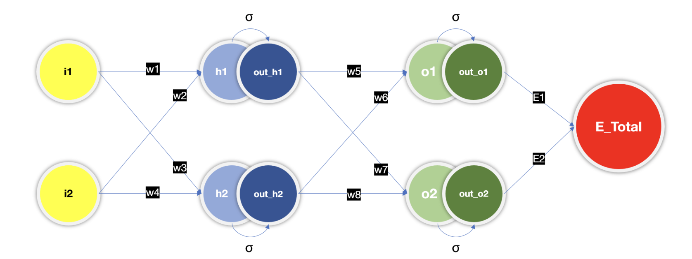
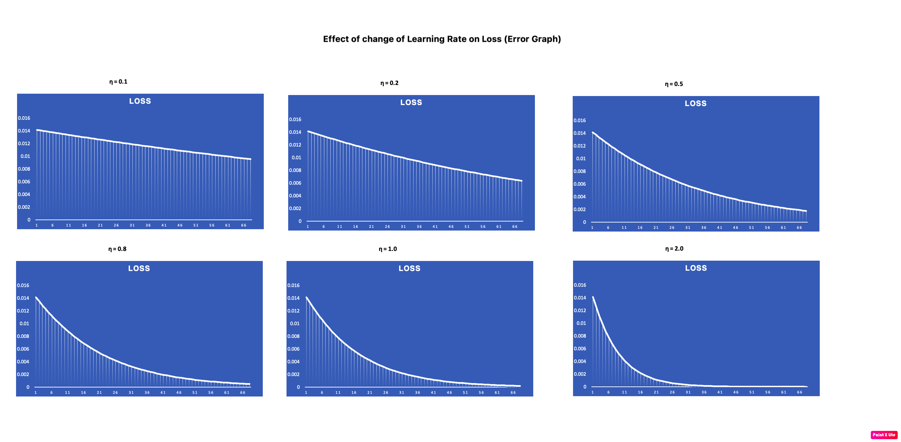
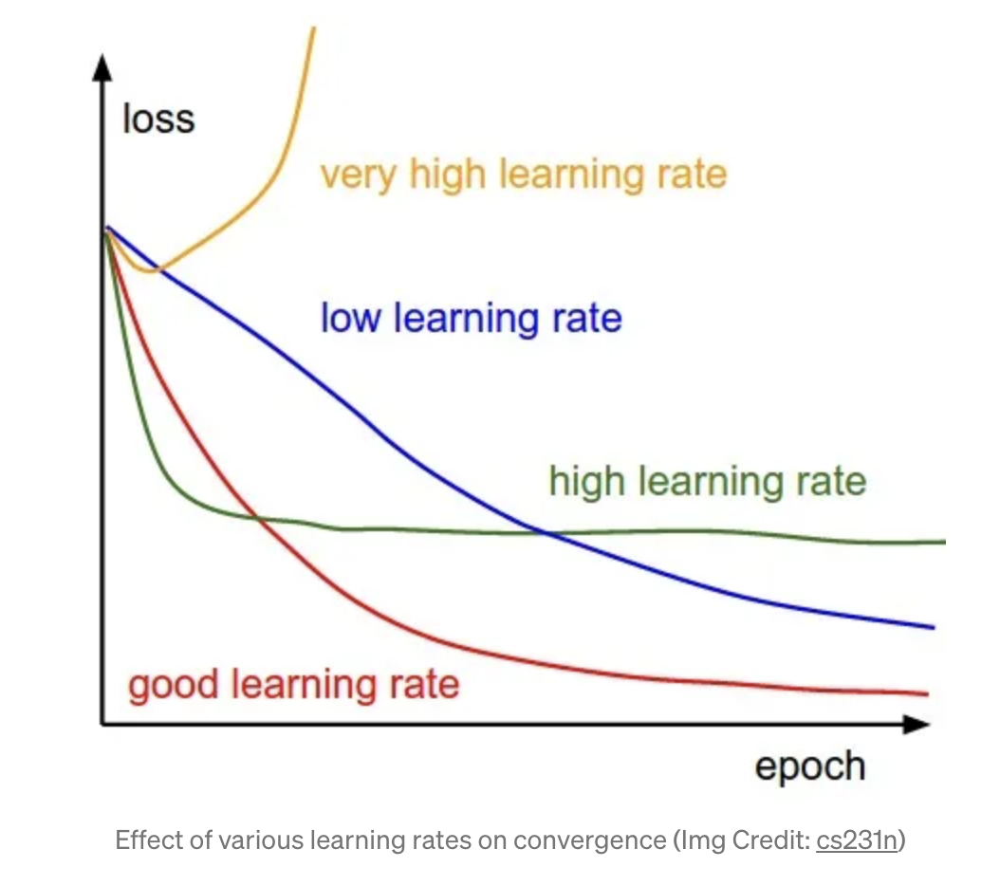
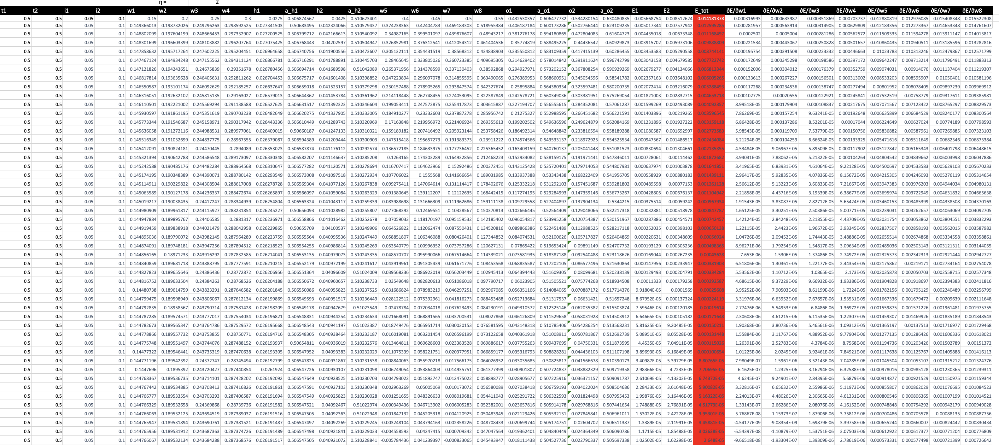

# S6 Assignment Part 1

## Objective :

PART 1[250]: Rewrite the whole Excel sheet showing backpropagation. Explain each major step, and write it on GitHub. 
1. **Use exactly the same values for all variables as used in the class**
2. Take a screenshot, and show that screenshot in the readme file
3. The Excel file must be there for us to cross-check the image shown on readme (no image = no score)
4. Explain each major step
5. Show what happens to the error graph when you change the learning rate from [0.1, 0.2, 0.5, 0.8, 1.0, 2.0] 
6. Upload all this to GitHub and then write all the above as part 1 of your README.md file. 
7. Submit details to S6 - Assignment QnA. 


## Overview:

The beauty of Neural Network algorithms in Deeplearning tasks is their being able to adjust themselves, 
while training, according to a given optimization strategy. Generally speaking, 
optimization strategies aim at minimizing the error given by the difference between 
the real target and the output of the algorithm. For each training iteration, 
the algorithm will compute this error using **Forward Propagation** and will re-calibrate its parameter so that,
during the next iteration using **Backward Propagation, the error will be reduced.<br>


### Simple Neural Network: 




### Neural Network with Weights:


* i1 and i2 are inputs
* w1,w2,w3,w4 are weights associated with inputs i1 and i2
* h1,h2 are hidden layer neurons
* a_h1,a_h2 - sigmoid function applied on h1 and h2
* w5,w6,w7,w8 are weights associated with hidden layer h1 and h2
* o1,o2 are output with a_o1 and a_o2 are applied activation function
* E1,E2 are error/loss function `E1 = 1/2*(t1-a_o1)^2` and `E2 = 1/2*(t2-a_o2)^2`

### Backpropagation calculation:


* **Partial Derivatives** form basis for Backward Propagation `d(f(x)/d(x) - Change in f(x) with respect to x`
* In order to minimize the difference between our neural network's output and the target output, we need to know how the model performance changes with respect to each parameter in our model. In other words, we need to define the relationship (read: partial derivative) between our cost function and each weight. We can then update these weights in an iterative process using gradient descent.
* It uses chain rule to calculate re calibrate weights.
* Block 1 Formula is to calculate Forward Propagation
* Block 2,3,4,5,6 formula are used for backward propagation.
* weights are recalibrated using - ` re-calibrated weights = existing weight - (learning rate) * partial derivative of loss function/partial derivative of specific weight`
* Learning rate plays vital role in learning process.

### Effect of Learning rate on loss function:






* The learning rate is the most important hyper-parameter for tuning neural networks. A good learning rate could be the difference between a model that doesn’t learn anything and a model that presents state-of-the-art results.


### Implementation of Backpropagation using excel:



* [BackPropagation.xlsx](BackPropagation.xlsx) - Please refer excel for more detailed implementation of backpropagation


# S6 Assignment Part 2

## Objective :

PART 2[250]:
1. 99.4% validation accuracy
2. Less than 20k Parameters
3. Less than 20 Epochs
4. Have used BN, Dropout,
(Optional): a Fully connected layer, have used GAP. 
5. To learn how to add different things we covered in this session, you can refer to this code: https://www.kaggle.com/enwei26/mnist-digits-pytorch-cnn-99 DONT COPY ARCHITECTURE, JUST LEARN HOW TO INTEGRATE THINGS LIKE DROPOUT, BATCHNORM, ETC.


### Model Summary:

```
----------------------------------------------------------------
        Layer (type)               Output Shape         Param #
================================================================
            Conv2d-1          [-1, 128, 28, 28]           1,280
       BatchNorm2d-2          [-1, 128, 28, 28]             256
         Dropout2d-3          [-1, 128, 28, 28]               0
            Conv2d-4            [-1, 8, 30, 30]           1,032
            Conv2d-5           [-1, 16, 30, 30]           1,168
       BatchNorm2d-6           [-1, 16, 30, 30]              32
         Dropout2d-7           [-1, 16, 30, 30]               0
         MaxPool2d-8           [-1, 16, 15, 15]               0
            Conv2d-9           [-1, 16, 15, 15]           2,320
      BatchNorm2d-10           [-1, 16, 15, 15]              32
        Dropout2d-11           [-1, 16, 15, 15]               0
           Conv2d-12           [-1, 32, 15, 15]           4,640
      BatchNorm2d-13           [-1, 32, 15, 15]              64
        Dropout2d-14           [-1, 32, 15, 15]               0
        MaxPool2d-15             [-1, 32, 7, 7]               0
           Conv2d-16             [-1, 16, 9, 9]             528
           Conv2d-17             [-1, 16, 9, 9]           2,320
      BatchNorm2d-18             [-1, 16, 9, 9]              32
        Dropout2d-19             [-1, 16, 9, 9]               0
           Conv2d-20             [-1, 32, 9, 9]           4,640
      BatchNorm2d-21             [-1, 32, 9, 9]              64
        Dropout2d-22             [-1, 32, 9, 9]               0
           Conv2d-23           [-1, 10, 11, 11]             330
        AvgPool2d-24             [-1, 10, 1, 1]               0
================================================================
Total params: 18,738
Trainable params: 18,738
Non-trainable params: 0
----------------------------------------------------------------
Input size (MB): 0.00
Forward/backward pass size (MB): 3.08
Params size (MB): 0.07
Estimated Total Size (MB): 3.15
----------------------------------------------------------------
```

**Test Accuracy : 99.43**


# References

- As I m new referred below Medium article

- [Reference](https://ravivaishnav20.medium.com/handwritten-digit-recognition-using-pytorch-get-99-5-accuracy-in-20-k-parameters-bcb0a2bdfa09)
